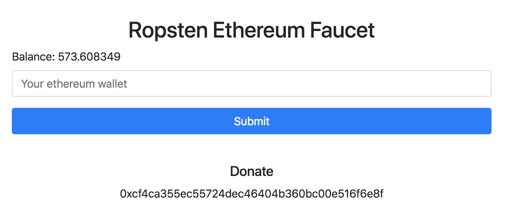

### 1. git clone https://github.com/niawjunior/Ethereum-faucet-firebase-function.git
### 2. cd Ethereum-faucet-firebase-function
### 3. npm install
### 4. edit project name at .firebaserc
### 5. edit api url at public/js/index.js (line 19)

### 6. fiebase deploy

### Hosting URL:
## your firebase hosting .ex https://xxxx.firebaseapp.com
